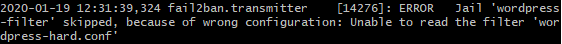

# Enterprise Linux Lab Report

- Student name: Piet Jacobs
- Github repo: <https://github.com/HoGentTIN/elnx-1920-sme-PietJ95.git>

Setting up basic automated installation for all upcoming servers

## Test plan

- SSH
    - On your host machine do `ssh 172.16.192.1` or any other server IP from this network
    - Type `yes` en hit `Enter`
    - Enter a wrong password 3 times, the 3rd time it should close the connection and ban you from connecting
    - Verify on the server by doing `vagrant ssh pr001` and check the log via `sudo vi /var/log/fail2ban.log`
        - There should be entries where you can see your connection attempts and a final `Ban` keyword with your host machine IP: `172.16.0.1` for the ssh service

## Procedure/Documentation
### Installing fail2ban on all servers (with server specific jails)

- All servers
    - sshd jail
- pu001 (wordpress)
    - Apache
    - Wordpress

Wordpress jail for 5x bad authentication using the wordpress-hard filter
- Installed the wordpress-fail2ban plugin
- Added filter `wordpress-hard` from the plugin to the `/etc/fail2ban/filter.d/` directory
- Enabled the jail using the filter and set a bantime & findtime

**note**: The filter seems to not be working properly, not sure what the reason is...  
Getting an error on the auto generated filter from the plugin:

## Test report

    
## Resources
Regex sources: 
- https://gist.github.com/sander1/3949f8a9d71eab1f8217f315e1788c2f
- https://graspingtech.com/using-fail2ban-protect-wordpress-blog-brute-force-attacks/